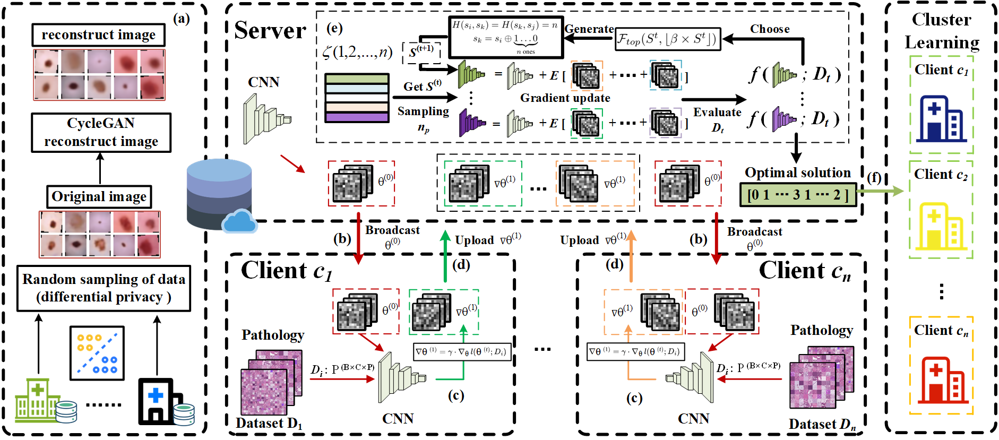
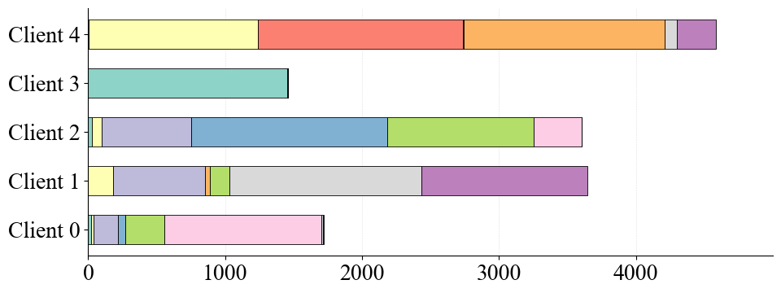
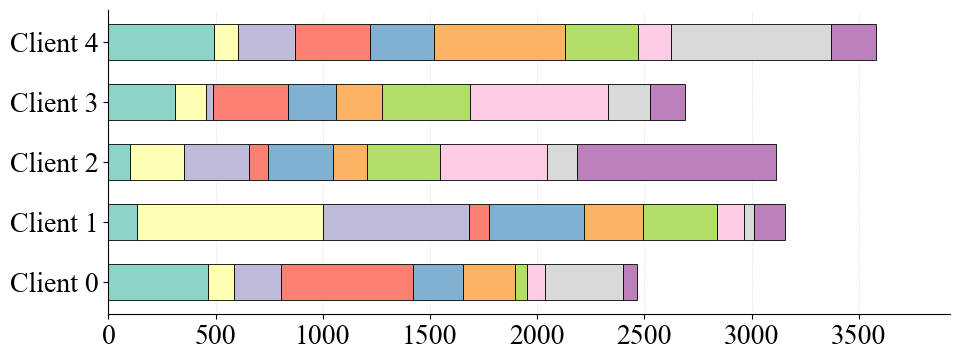
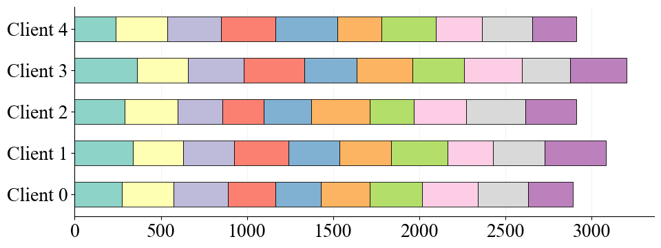

# PIFCA: Efficient Federated Clustering with Gradient Search Optimization for Medical Edge Networks

Official implementation of the paper:  
**"PIFCA: Federated Clustering Addressing Non-IID Skew With Gradient Space Disentanglement"**  
[[Paper]](link-to-your-paper) | [[Project Page]](link-to-project-page)

---

## Overview
PIFCA (**Preliminary Iterative Federated Clustering Algorithm**) is designed to tackle statistical heterogeneity in federated learning by **efficiently clustering clients based on gradient-space search** in the early training stage.  
Unlike traditional similarity-based methods that require stable gradients or fixed thresholds, PIFCA constructs a **privacy-preserving synthetic sampling dataset** and evaluates multiple client-cluster combinations via **gradient combination accuracy and entropy**.  
Through iterative search, it locks optimal cluster assignments in a **single-step operation**, improving both **accuracy** and **communication efficiency** in highly non-IID environments.


**Key Features:**
- **Early clustering** using unstable gradients via synthetic sampling.
- **Gradient combination search** for optimal group allocation.
- **Scalable** to large client numbers and dynamic user participation.
- **Plug-in** capability to enhance existing FL algorithms.

---

## Datasets
We use three datasets from **MedMNIST** and two **CIFAR-datasets** for experiments:
- **DermaMNIST**
- **BloodMNIST**
- **OrganAMNIST**
- **CIFAR-10**
- **CIFAR-100**

### Data Partitioning
To simulate different levels of statistical heterogeneity, we partition each dataset among clients using a **Dirichlet distribution** with concentration parameter α ∈ {0.1, 1, 100}:
- **Lower α** → stronger label imbalance (highly non-IID)
- **Higher α** → more uniform label distribution (close to IID)
```bash
python generate_Cifar10.py  noniid - dir # for practical noniid and unbalanced scenario
# python generate_Cifar10.py iid - - # for iid and unbalanced scenario
# python generate_Cifar10.py iid balance - # for iid and balanced scenario
# python generate_Cifar10.py noniid - pat # for pathological noniid and unbalanced scenario
# python generate_Cifar10.py noniid - exdir # for Extended Dirichlet strategy
```
The following shows the data distribution of five users under different Dirichlet coefficients.
|  |  |  |
|:------------------------:|:--------------------:|:-------------------------:|
| α = 0.1                  | α = 1                | α = 100                   |


### Synthetic Sampling Dataset
In order to evaluate clustering performance without exposing real data:
1. We **randomly sample** a small portion of images from each client's dataset.
2. These sampled images are used as input to a **CycleGAN** model to generate a **privacy-preserving synthetic dataset**.
3. This synthetic dataset preserves statistical characteristics of the original distribution while protecting client privacy.
4. PIFCA uses this dataset to evaluate **accuracy** and **entropy** of different client-cluster combinations in early training rounds.
<br>Sampling VS. Original Distribution. Partial biased
sampling retains true distribution information


## Installation

```bash
git clone https://github.com/Network-Optimization/PIFCA.git
cd PIFCA
conda create -n pifca python=3.8
conda activate pifca
pip install -r requirements.txt
```

---

## Running Experiments

### PIFCA
```bash
# Example: OrganAMNIST dataset, α=0.1
python main1.py -data OrganAMNIST_0.1 -m CNN -algo Local -gr 100 -lr 0.001 -ncl 11 -dev cuda -did 0,1
```

Alternatively, define multiple experiments in `sh1-1.py` and run:
```bash
python sh1-1.py
```

### Baseline Algorithms
```bash
python sh1-1.py  # Runs predefined baselines with stored datasets
```

### Cluster Partitioning
- `PIFCA-de.ipynb` → DermaMNIST clustering  
- `PIFCA-or+bl.ipynb` → OrganAMNIST & BloodMNIST clustering  
- Pass clustering results into `serveravg_test.py` and set:
```python
a = [1, 1, 1, 1, 1, 0, 0, 0, 0, 1]  # Same label for clients in the same cluster
```

---

## Results

### Accuracy under α=0.1 (Highly Non-IID)
| Dataset       | Best Baseline | PIFCA  | Gain   |
|---------------|--------------|--------|--------|
| DermaMNIST    | 70.42        | 74.28  | +3.86% |
| OrganAMNIST   | 61.75        | 71.55  | +9.80% |
| BloodMNIST    | 82.90        | 87.82  | +4.92% |
| CIFAR-10      | 44.71        | 51.74  | +7.03% |
| CIFAR-100     | 21.84        | 26.75  | +4.91% |

### Communication Rounds to Reach 75% of Max Accuracy
PIFCA reduces required rounds by **29.9%** on average compared to baselines.

---

## Citation
If you use this code, please cite:
```bibtex
@article{pifca2025,
  title={PIFCA: Federated Clustering Addressing Non-IID Skew With Gradient Space Disentanglement},
  author={Your Name and Others},
  journal={IEEE INFOCOM},
  year={2026}
}
```

---

## Acknowledgements
- Code framework adapted from [PFLlib](https://www.pfllib.com/docs.html)
- Dataset source: [MedMNIST](https://medmnist.com/)

